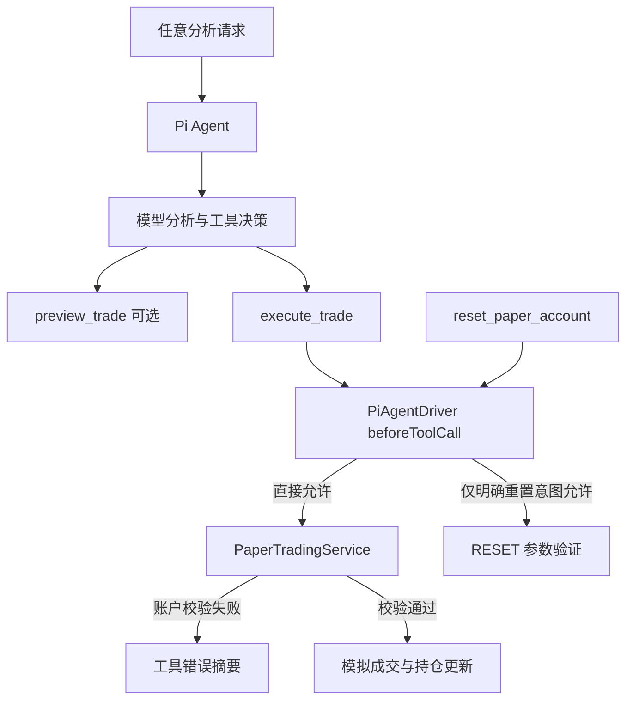

# Design Document

## Overview

自主模拟交易不新增策略循环、定时任务或真实交易适配器。它只删除 `PiAgentDriver.beforeToolCall` 对 `execute_trade` 的“当前用户输入必须含交易意图”检查：只要模型在现有会话中调用模拟交易工具，就直接通过至 `PaperTradingService`。交易服务继续是唯一的账户状态写入点，保留价格、整手、现金、费用、持仓、T+1 与 A 股市场边界。

`reset_paper_account` 不属于调仓，继续沿用显式重置意图门禁和 `RESET` 参数验证。系统提示同步更新，明确 Agent 可以自主执行本地模拟买卖，且必须以已调用工具结果说明执行依据、风险与结果。

## Steering Document Alignment

### Technical Standards (tech.md)

未提供 `tech.md`。遵循项目约束：Bun、TypeScript、失败测试先行、源文件少于 250 个非空行、所有可见 TUI 文本沿用既有宽度收口。此功能不新增网络、后台循环或真实券商依赖。

### Project Structure (structure.md)

未提供 `structure.md`。变更集中于 `src/pi-agent.ts` 的 Agent 调用边界与系统提示；`src/agent-tools.ts` 仅调整工具的自主模拟执行语义；`src/trading.ts` 不修改账户模型。测试保持在现有 `test/pi-agent.test.ts`、`test/agent-tools.test.ts` 与 `test/trading.test.ts`。

## Code Reuse Analysis

### Existing Components to Leverage

- **`PiAgentDriver.beforeToolCall`**：当前唯一按自然语言阻断 `execute_trade` 与 `reset_paper_account` 的位置；改为仅对重置执行意图审查。
- **`authorizeAgentTool`**：保留公开测试接口。对 `execute_trade` 恒返回允许；对 `reset_paper_account` 保持现有正向重置匹配。
- **`PaperTradingService.preview/execute`**：不修改；持续处理资金、费用、整手、T+1、持仓和海外代码分析边界。
- **`AgentTool` 生命周期与 `AgentController`**：交易的开始、结束、成功/错误摘要已显示于 Agent 面板，无需另建确认 UI。

### Integration Points

- **系统提示**：将“用户明确给出买卖指令后”替换为“可基于分析自主模拟买卖”；保留真实券商禁止、工具调用真实性与风险说明。
- **工具元数据**：`execute_trade` 归类为可自主执行的本地写操作，不引入交互式批准处理；`reset_paper_account` 保持 `exec` + `override`。
- **账户写入**：所有成功交易仍由 `PaperTradingService.execute()` 生成 `SIM-*` 成交和持仓更新。

## Architecture



### Modular Design Principles

- **Single File Responsibility**：授权边界只由 `pi-agent.ts` 改变；账户模型与风控不被复制或修改。
- **Component Isolation**：Agent 面板继续只渲染工具事件，不判断交易授权。
- **Service Layer Separation**：Agent 可以请求操作，`PaperTradingService` 决定账户状态是否可变。
- **Utility Modularity**：`authorizeAgentTool` 的交易与重置分支可独立行为测试。

## Components and Interfaces

### Agent 调用授权 — `src/pi-agent.ts`

- **Purpose:** 允许模型自主发起本地模拟买卖，同时防止意外的账户清空。
- **Interface:**

```ts
export function authorizeAgentTool(toolName: string, input: string): boolean
```

- **Behavior:**
  - `execute_trade` 与所有非重置工具恒为 `true`。
  - `reset_paper_account` 仅当输入明确表达“重置/清空账户”时为 `true`。
  - 取消交易关键词、确认词和否定词解析；不基于自然语言阻断买卖。
- **Dependencies:** `Agent.beforeToolCall`。
- **Reuses:** 既有工具事件和错误摘要。

### 模拟交易工具 — `src/agent-tools.ts`

- **Purpose:** 向模型表达交易工具可以自主执行本地模拟账户操作。
- **Behavior:** `execute_trade` 描述明确“Agent 可自主执行”；保持独占并发、调用 `PaperTradingService.execute()`、结果 JSON 和账户刷新。
- **Dependencies:** `CommandContext`、`PaperTradingService`。
- **Reuses:** 现有 Zod 参数和工具结果格式。

## Data Models

本功能不新增持久化或运行时数据模型。已有数据流保持不变：

```ts
AgentToolCall -> PaperTradingService.execute()
  -> TradePreview
  -> SimulatedTrade { id: "SIM-...", tradeDate, executedAt }
  -> PaperTradingState / PortfolioSnapshot
```

## Error Handling

### Error Scenarios

1. **自主交易违反账户或市场规则**
   - **Handling:** `PaperTradingService` 返回既有失败结果；工具抛出可读错误且不写入状态。
   - **User Impact:** Agent 面板显示失败摘要；没有确认弹窗，也没有现金、持仓、成交变更。

2. **分析请求包含“仅分析”或否定交易文字，但模型调用了交易工具**
   - **Handling:** 不再由自然语言授权函数阻断；模型工具调用直接进入模拟账户校验。
   - **User Impact:** 模型的实际工具调用决定是否执行，结果在面板可见。

3. **模型试图重置账户**
   - **Handling:** `beforeToolCall` 继续检查明确重置意图，工具本身仍要求 `RESET`。
   - **User Impact:** 普通分析或调仓无法清空账户；明确重置才可继续。

4. **模型声称交易但未调用工具**
   - **Handling:** 系统提示继续禁止该行为；工具生命周期是唯一的实际执行证据。
   - **User Impact:** 面板记录可核对真实模拟执行。

## Testing Strategy

### Unit Testing

- `pi-agent.test.ts`：对任意普通、否定、中英文输入验证 `execute_trade` 均允许；重置意图仍严格区分。
- `agent-tools.test.ts`：交易工具保留独占并发、调用既有服务并返回成交/拒绝结果。
- `trading.test.ts`：复用既有资金、整手、T+1、海外代码拒绝与无状态变更测试。

### Integration Testing

- 使用脚本 Agent driver 模拟在“分析持仓”请求中发起 `execute_trade`，验证没有驱动层拦截且 `AgentController` 记录成功或账户规则失败事件。
- 验证重置工具在相同分析请求中被阻断。

### End-to-End Testing

- 在 Agent 窗口输入普通分析请求，脚本化工具调用产生模拟成交；确认面板显示工具开始、结束与结果，且无确认命令或额外输入步骤。
- 输入无法成交的请求，验证错误可见且账户快照不变。
