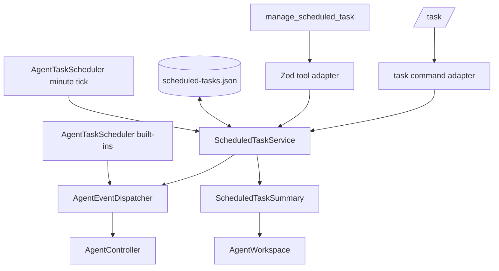

# Design Document

## Overview

将当前只包含盘前、盘中和记忆整理分支的 `AgentTaskScheduler` 扩展为统一 tick 驱动的两层调度：保留内置任务的既有语义；新增独立、持久化的用户定时任务服务。用户任务仅在到期时创建带来源元数据的 `AgentSystemEvent`，仍由 `AgentEventDispatcher` 串行送入 `AgentController`。

`/task` 与 Agent 工具共享 `ScheduledTaskService`。前者负责将终端参数解析成受校验输入，后者以 Zod schema 接收结构化参数；两条入口不各自维护状态或调度算法。

## Steering Document Alignment

### Technical Standards (tech.md)

`.spec-workflow/steering/` 没有项目 steering 文件。设计遵循仓库约束：Bun 执行全部命令；新增行为先由失败测试定义；可见 TUI 行使用 `fitLine`；A 股红涨绿跌保持不变；每个源文件不超过 250 个非空行。

### Project Structure (structure.md)

沿用当前分层：纯模型与时间计算位于独立领域模块，JSON 文件访问单独封装，服务管理状态与副作用，命令/Agent 工具只是适配器，`app.ts` 只组合服务和生命周期。

## Code Reuse Analysis

### Existing Components to Leverage

- **`AgentTaskScheduler`**：继续拥有唯一的注入式一分钟 tick、启停幂等和内置盘前/盘中/做梦行为；在 tick 末尾委托用户任务服务，不为任务注册独立计时器。
- **`AgentEventDispatcher`**：作为唯一事件入口，沿用 `dedupeKey` 去重和串行 `AgentController.prompt` 调用。
- **`defaultAppDataPath`、`readJsonFile`、`writeJsonFileAtomically`**：沿用 `PaperAccountStore` 的本地原子 JSON 保存模式。
- **`AUTOMATION_COMMANDS` 与 `CommandContext`**：沿用中文 `CommandResult`、可选服务 getter 和命令自动发现。
- **`createConditionAgentTools` / `createMemoryAgentTools`**：沿用独立工具文件、Zod 参数校验、结构化 JSON 结果和 `approval: "write"` 模式。
- **`AgentWorkspace` 与 `fitLine`**：在不改变工作区结构的前提下显示紧凑自定义任务摘要。

### Integration Points

- `MarketIntelligenceApp` 创建 `ScheduledTaskStore`、`ScheduledTaskService`，将服务注入 `AgentTaskScheduler` 和 `CommandContext`，并在 Agent 工具聚合时复用该上下文。
- `AgentTaskScheduler.#tick()` 先维持现有内置任务分支，再调用 `ScheduledTaskService.tick(now)`；全局 `/schedule off` 继续禁止所有自动触发，`/task run` 则绕过时间规则但仍走 dispatcher 去重。
- `AgentSystemEvent` 扩展为可选 `taskId`、`taskName` 和 `source: "builtin" | "user"` 元数据；旧调用方无需变更其既有字段。
- `AgentWorkspace` 接收只读 `ScheduledTaskSummary`，用一行显示启用用户任务数、最近任务或存储诊断；所有文本经 `fitLine` 截断。

## Architecture



### Modular Design Principles

- **Single File Responsibility**：类型/规则、存储、服务、命令、Agent 工具和 TUI 摘要各自独立。
- **Component Isolation**：渲染层只消费摘要，不能写任务、计算到期或触碰 timer。
- **Service Layer Separation**：`ScheduledTaskService` 是状态修改和事件提交的唯一入口；store 不做业务规则；领域模块不写文件也不发事件。
- **Utility Modularity**：下次运行时间和输入校验为纯函数，统一使用 Asia/Shanghai 时间语义。

## Components and Interfaces

### `src/scheduled-tasks.ts`

- **Purpose:** 定义用户任务、调度规则和纯校验/下次运行计算。
- **Interfaces:**
  - `ScheduledTaskSchedule = once | daily | interval`
  - `validateScheduledTaskInput(input, now): ScheduledTaskValidation`
  - `nextScheduledRunAt(schedule, now): string | null`
  - `advanceScheduledTask(task, now): ScheduledTask`
- **Dependencies:** `trading-calendar` 的 Shanghai 日期/时间解析。
- **Rules:** `once` 使用未来 ISO 时间；`daily` 为 `HH:mm` 与可选 `weekdaysOnly`；`interval` 限制为 1–1,440 分钟。睡眠恢复时只选择当前或过去最近的一次，不生成积压序列。

### `src/scheduled-task-store.ts`

- **Purpose:** 读写版本化用户任务状态。
- **Interfaces:**
  - `defaultScheduledTaskPath(): string`
  - `load(): ScheduledTaskStoreLoadResult`
  - `save(state: ScheduledTaskState): void`
- **Dependencies:** `json-file.ts`。
- **Rules:** 缺失文件返回空状态；解析、版本或结构失败返回空状态与诊断，不覆盖损坏源文件，直到后续成功状态变更触发保存。

### `src/scheduled-task-service.ts`

- **Purpose:** 管理用户任务 CRUD、持久化、到期处理与可观察性。
- **Interfaces:**
  - `list(): readonly ScheduledTask[]`
  - `get(id: string): ScheduledTask | undefined`
  - `create(input, source): ScheduledTask`
  - `update(id, input, source): ScheduledTask`
  - `pause(id)`, `resume(id)`, `remove(id)`, `runNow(id)`
  - `tick(now): void`
  - `summary(now): ScheduledTaskSummary`
- **Dependencies:** `ScheduledTaskStore`、`AgentEventSink`、注入时钟。
- **Rules:** 修改前完整验证；每次状态变化原子保存。到期任务先推进 `nextRunAt` 并记录结果，然后 enqueue。`queued` 记录为已排队，`deduped` 记录为跳过；同一任务使用 `task:<id>` 去重。一次性任务成功提交后转为 `completed` 并无下次运行。`runNow` 不改变既定下一次时间，仅走相同事件构造和去重。

### `src/agent-scheduler.ts`

- **Purpose:** 继续拥有单一 timer 和全局自动化开关。
- **Changes:** 可选注入 `tasks: ScheduledTaskService`；扩展 `AgentTaskKind` 为 `"custom"`；当全局启用时，单次 tick 调用 `tasks.tick(now)`；`stop()` 只清理唯一 timer，不删除持久化任务。
- **Compatibility:** `preopen`、`intraday`、`dream` 的 prompt、时段判断和 `runNow` 返回值保持不变。

### `src/task-commands.ts`

- **Purpose:** 实现 `/task` 的终端参数解析与中文结果。
- **Commands:**
  - `/task [list]`
  - `/task add once <ISO> <名称> :: <提示>`
  - `/task add daily <HH:mm> [weekdays] <名称> :: <提示>`
  - `/task add interval <分钟> <名称> :: <提示>`
  - `/task update <id> <同 add 规则>`
  - `/task pause|resume|remove|run <id>`
  - `/task builtin`
- **Rules:** 名称和提示以 `::` 分隔，支持空格；输入错误返回完整中文用法；只允许操作用户任务；列表通过 `fitLine` 在实际渲染路径适配宽度。

### `src/task-agent-tools.ts`

- **Purpose:** 让 Agent 真实管理用户任务。
- **Tool:** `manage_scheduled_task`。
- **Schema:** `action: list | create | update | pause | resume | remove | run`；创建/更新使用结构化的 name、prompt、schedule、weekdaysOnly、minutes、at 与 id 字段。
- **Rules:** `approval: "write"`；读操作也返回真实 service 状态；写操作返回任务、下次时间和来源；不提供内置任务修改能力。

### `src/command-context.ts`, `src/agent-tools.ts`, `src/app.ts`, `src/components/agent.ts`

- **Purpose:** 组合服务并显示摘要。
- **Changes:** `CommandContext` 新增可选 `scheduledTasks()`；`agent-tools.ts` 追加 `createScheduledTaskAgentTools(context)`；`app.ts` 在调度器前创建 service 并传入；Agent 面板构造参数追加摘要，输出一条经 `fitLine` 的任务状态。

## Data Models

### `ScheduledTask`

```ts
type ScheduledTaskSchedule =
  | { readonly kind: "once"; readonly at: string }
  | { readonly kind: "daily"; readonly time: string; readonly weekdaysOnly: boolean }
  | { readonly kind: "interval"; readonly minutes: number }

type ScheduledTaskRunState = "queued" | "skipped" | "completed" | "failed"

interface ScheduledTask {
  readonly id: string
  readonly name: string
  readonly prompt: string
  readonly schedule: ScheduledTaskSchedule
  readonly createdBy: "user" | "agent"
  readonly createdAt: string
  readonly updatedAt: string
  readonly enabled: boolean
  readonly nextRunAt: string | null
  readonly lastRun?: { readonly at: string; readonly state: ScheduledTaskRunState; readonly reason?: string }
}
```

### `ScheduledTaskState` and summary

```ts
interface ScheduledTaskState {
  readonly version: 1
  readonly sequence: number
  readonly tasks: readonly ScheduledTask[]
}

interface ScheduledTaskSummary {
  readonly enabledCount: number
  readonly nextTask: Pick<ScheduledTask, "id" | "name" | "nextRunAt"> | null
  readonly lastRun: Pick<ScheduledTask, "id" | "name" | "lastRun"> | null
  readonly diagnostic: string | null
}
```

## Error Handling

1. **无效规则或 `/task` 语法**
   - **Handling:** 在领域模块或命令适配器中完整校验；拒绝并保持当前状态不变。
   - **User Impact:** 显示中文错误与精确用法。

2. **同一任务重叠或 dispatcher 已释放**
   - **Handling:** `enqueue` 返回 `deduped`；service 保存“跳过”及原因，并推进下一次时间。
   - **User Impact:** 列表和 Agent 摘要显示最近跳过原因，不伪造执行成功。

3. **任务文件损坏**
   - **Handling:** store 返回空集合与诊断，不 throw。
   - **User Impact:** 应用继续运行，`/task list` 和 Agent 面板显示诊断。

4. **Agent 执行失败**
   - **Handling:** dispatcher 保持现有错误隔离并继续后续事件；service 至少保留已提交结果。后续可在 dispatcher 增加完成观察回调时将真实完成/失败回写，不阻塞本次功能。
   - **User Impact:** Agent 面板显示既有失败信息；任务最后状态明确为“已排队”而不声称成功完成。

5. **删除、暂停或退出时的待执行任务**
   - **Handling:** 服务先改变持久化状态；后续 tick 不再提交。退出继续调用 scheduler stop 和 dispatcher 的既有 `cancelPending` 流程。
   - **User Impact:** 不会再有新的自动任务；已有队列依照应用关闭策略取消。

## Testing Strategy

### Unit Testing

- `scheduled-tasks.test.ts`：三种规则、Shanghai 时区边界、工作日限制、无效时间/间隔/提示、下次时间计算与补跑上限。
- `scheduled-task-store.test.ts`：正常读写、缺失文件、结构错误、版本错误、损坏 JSON 和不覆盖损坏文件。
- `scheduled-task-service.test.ts`：CRUD、来源、暂停/恢复、手动运行、一次性完成、tick、dedupe、跳过记录、重启恢复和全局开关隔离。
- `agent-scheduler.test.ts`：注入 service 后与盘前/盘中/做梦同一 tick 调用，并保持现有断言不变。

### Integration Testing

- `commands.test.ts`：`/task` 列表、三种创建、更新、暂停、恢复、删除、立即运行、内置边界、中文错误和多词名称/提示。
- `agent-tools.test.ts`：`manage_scheduled_task` 对应每种操作真实调用服务，返回结构化结果与验证失败。
- `agent.test.ts`：任务摘要在受限宽度下完整适配，且不改变既有输入/滚动布局。

### End-to-End Testing

使用 fake timer、固定时钟、临时数据目录和 scripted Agent：创建用户任务后启动应用；验证事件只在到期时提交、重启恢复、sleep 后仅补跑一次、暂停/删除不再提交；同时验证盘前/盘中/做梦仍能按旧语义派发，所有事件经同一 dispatcher 串行处理。最终运行 `bun run test`、`bun run typecheck` 与 `bun run lint`。