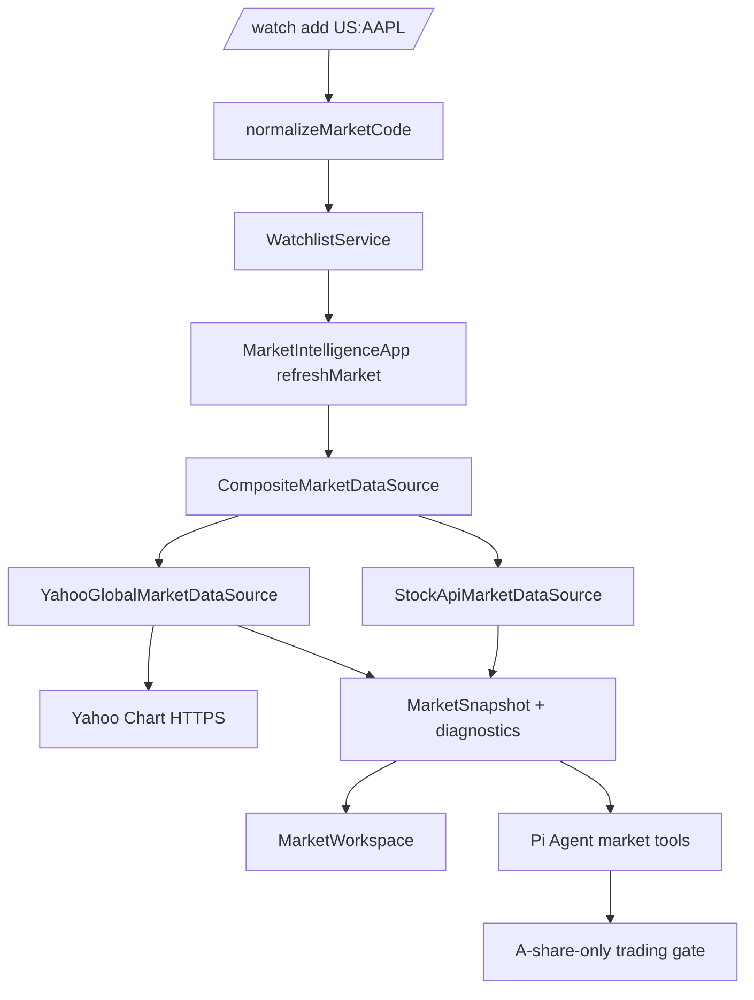

# Design Document

## Overview

全球市场数据在现有行情通道上扩展，而非创建第二套刷新和状态系统。自选列表接受明确市场前缀：`US:`, `JP:`, `KR:`；`CompositeMarketDataSource` 按市场切分代码，继续使用 `StockApiMarketDataSource` 获取 A 股，并通过无密钥的 Yahoo Finance Chart HTTPS 端点获取美股、东证与韩交所报价及日线走势。各市场请求独立结算并合并成功结果，保证海外失败不影响 A 股刷新。

Yahoo Chart 的规范 ticker 映射固定为：`US:AAPL -> AAPL`、`JP:7203 -> 7203.T`、`KR:005930 -> 005930.KS`。该适配器封装在明确接口后，可在不影响业务层的情况下被需要密钥的供应商替换。它不是下单或估值服务；海外行情仅进入展示与 Agent 分析上下文。

## Steering Document Alignment

### Technical Standards (tech.md)

未提供 `tech.md`。实现遵循项目约束：Bun、TypeScript、失败测试先行、每个源文件少于 250 个非空行、所有可见 TUI 行使用 `fitLine`/`alignCell` 收口。网络数据使用 `fetch` 注入的 fixture 测试，不访问真实互联网。

### Project Structure (structure.md)

未提供 `structure.md`。新模块保持现有扁平服务层：代码解析位于 `src/market-code.ts`，Yahoo 适配器位于 `src/global-market-data.ts`，合并数据源位于 `src/market-data.ts`；自选、Agent、交易与 `components/market.ts` 只使用稳定接口。

## Code Reuse Analysis

### Existing Components to Leverage

- **`StockApiMarketDataSource`**：保持 A 股抓取、趋势和输入清洗行为；复合数据源只在 A 股代码非空时调用它。
- **`MarketDataSource` / `MarketSnapshot`**：作为所有市场刷新的单一契约，扩充市场、币种、状态、时间与部分失败诊断字段。
- **`WatchlistService` / `WatchlistCoordinator`**：继续负责自选标准化、持久化和刷新；仅将 A 股归一化替换为市场感知归一化。
- **`MarketWorkspace`**：继续渲染当前快照和涨跌颜色；按宽度在完整跨市场表格与紧凑行之间切换。
- **`createAStockAgentTools` / `PaperTradingService`**：行情工具自然读取合并快照；交易入口使用共享 `isAshareCode` 门禁拒绝海外报价。
- **`fitLine`、`alignCell`、`visibleWidth`**：保证跨市场名称、币种和状态不超出终端宽度。

### Integration Points

- **应用刷新**：`MarketIntelligenceApp.refreshMarket()` 保持不变，默认注入的市场源改为复合源；无海外自选股时不启动 Yahoo 请求。
- **持久化**：`WatchlistState` 版本仍为 `1`，其 `codes` 数组保存带前缀的规范海外代码，已有 A 股存档无需迁移。
- **命令与 Agent**：`/watch`、`manage_watchlist` 使用同一标准化逻辑；`get_market_snapshot`、`get_app_status` 和报价解析呈现市场元数据；交易预览/执行和命令交易统一拒绝非 A 股。

## Architecture



### Modular Design Principles

- **Single File Responsibility**：`market-code.ts` 只解析代码；`global-market-data.ts` 只构造 Yahoo 请求和映射响应；复合源只分组、并行与合并。
- **Component Isolation**：`MarketWorkspace` 不发起网络 I/O，只基于快照在宽度允许时显示市场/币种/状态。
- **Service Layer Separation**：提供商响应不会泄漏到自选、交易或 Agent；业务层仅接收验证后的 `MarketQuote`。
- **Utility Modularity**：ticker 映射、数值验证、控制字符过滤、诊断格式化分别可单测。

## Components and Interfaces

### 市场代码 — `src/market-code.ts`

- **Purpose:** 识别 A 股、美股、日本和韩国规范代码，提供数据源分流和交易门禁。
- **Interfaces:**

```ts
export type StockMarket = "CN" | "US" | "JP" | "KR"
export interface ParsedMarketCode { readonly market: StockMarket; readonly code: string; readonly providerSymbol: string }
export function normalizeMarketCode(input: string): string | null
export function parseMarketCode(code: string): ParsedMarketCode | null
export function isAshareCode(code: string): boolean
```

- **Dependencies:** 无网络依赖。
- **Rules:** A 股保留 `SH`/`SZ` 六位代码；美股 symbol 使用 1–10 位大写字母、数字、`.` 或 `-`；日/韩股票为固定六位数字；未知前缀拒绝。

### Yahoo 全球适配器 — `src/global-market-data.ts`

- **Purpose:** 对每个全球代码请求 Yahoo Chart API，取得报价、币种、交易所、状态、时间与 24 个日线收盘价。
- **Interfaces:**

```ts
export interface GlobalMarketHttp { fetch(input: string, init?: RequestInit): Promise<Response> }
export class YahooGlobalMarketDataSource {
  constructor(http?: GlobalMarketHttp)
  loadSnapshot(codes: readonly string[]): Promise<GlobalMarketLoadResult>
}
export interface GlobalMarketLoadResult {
  readonly quotes: readonly MarketQuote[]
  readonly diagnostics: readonly MarketDataDiagnostic[]
}
```

- **Dependencies:** Bun/global `fetch`、`market-code.ts`。
- **Rules:** URL 只能使用 `https://query1.finance.yahoo.com/v8/finance/chart/<encoded ticker>`；`range=1mo&interval=1d`；每个 ticker 用 `Promise.allSettled` 隔离。只有有效正价格、有限涨跌幅、匹配预期交易所后缀、无控制字符名称与允许币种的结果可映射。

### 复合行情源 — `src/market-data.ts`

- **Purpose:** 合并 A 股和全球成功结果，保留可读来源和每代码诊断。
- **Interfaces:**

```ts
export interface MarketDataDiagnostic {
  readonly code: string
  readonly market: StockMarket
  readonly message: string
}
export interface MarketQuote {
  readonly code: string
  readonly name: string
  readonly price: number
  readonly changePercent: number
  readonly source: string
  readonly market: StockMarket
  readonly currency: string
  readonly marketState: "open" | "closed" | "delayed" | "unknown"
  readonly asOf: number | null
}
export interface MarketSnapshot {
  readonly quotes: readonly MarketQuote[]
  readonly trend: readonly number[]
  readonly source: string
  readonly diagnostics: readonly MarketDataDiagnostic[]
}
export class CompositeMarketDataSource implements MarketDataSource { /* partitions and merges */ }
```

- **Dependencies:** A 股源与 Yahoo 源。
- **Rules:** 空的子分组不调用对应源；任一分组有有效报价即返回合并快照；所有分组失败时抛出合并后的无秘密诊断；趋势继续使用焦点代码所属数据源的走势。

### 自选、展示和交易门禁

- **Purpose:** 在统一自选体验中安全显示海外数据，并阻止它们进入 A 股模拟交易。
- **Changes:**
  - `WatchlistService` 使用 `normalizeMarketCode`，错误提示列出四种格式。
  - `MarketWorkspace` 在宽屏表格显示代码、市场/币种、名称、价格、涨跌、状态；窄屏保留代码、价格、涨跌并以 `fitLine` 截断。
  - `MarketQuote` 解析支持规范海外代码；`Agent` 的行情描述明确包含市场、币种、状态和更新时间。
  - `PaperTradingService` 或共享交易验证在预览和执行前使用 `isAshareCode` 拒绝全球代码，返回“海外股票当前仅支持分析”。

## Data Models

### 规范市场代码

```ts
type CanonicalCode =
  | `SH${string}`
  | `SZ${string}`
  | `US:${string}`
  | `JP:${string}`
  | `KR:${string}`
```

### 市场诊断

```ts
interface MarketDataDiagnostic {
  code: string             // 已标准化、无密钥的自选代码
  market: "CN" | "US" | "JP" | "KR"
  message: string          // 不含 URL 查询参数、响应正文或环境变量
}
```

## Error Handling

### Error Scenarios

1. **代码不合法或不支持**
   - **Handling:** 在 `normalizeMarketCode` 返回 `null`，自选服务拒绝修改且显示格式示例。
   - **User Impact:** 无状态变更；用户看到可操作提示。

2. **单个海外 ticker 网络、HTTP、JSON 或字段验证失败**
   - **Handling:** 记录该规范代码的简短诊断，保留同批其他成功报价。
   - **User Impact:** 成功条目照常显示；Agent 读取快照可见缺失限制。

3. **所有市场失败**
   - **Handling:** 复合源抛出不含密钥与完整 URL 的错误；应用维持既有刷新失败状态。
   - **User Impact:** 面板显示“获取失败 · R重试”。

4. **尝试以海外报价模拟交易**
   - **Handling:** 交易服务在任何入口拒绝，且不产生持仓、成交或持久化状态变更。
   - **User Impact:** 返回“海外股票当前仅支持分析”。

## Testing Strategy

### Unit Testing

- `market-code.test.ts`：A/美/日/韩合法和非法代码、ticker 后缀、A 股交易门禁。
- `global-market-data.test.ts`：成功的 US/JP/KR Yahoo fixture、URL 编码、货币/状态/时间映射、空/恶意字段拒绝、每 ticker 部分失败。
- `market-data.test.ts`：复合源无海外代码时不调用全球源、并行合并、焦点趋势、全失败错误与诊断。
- `watchlist.test.ts`、`trading.test.ts`：海外自选持久化和交易拒绝。

### Integration Testing

- `command-window.test.ts`：`/watch add US:AAPL|JP:7203|KR:005930`，命令反馈与窄宽行约束。
- `agent-tools.test.ts`：快照包含跨市场元数据，海外交易预览/执行均被拒绝。
- `market.test.ts`：完整与紧凑跨市场表格的市场/币种/状态和红涨绿跌约定。

### End-to-End Testing

- 以 HTTP fixture 构造默认复合源，在同一刷新中验证 A 股与美日/韩部分成功、TUI 绘制、Agent 可见快照和模拟账户不变。
- 断言没有海外自选时默认 A 股请求和可见输出保持当前行为。
