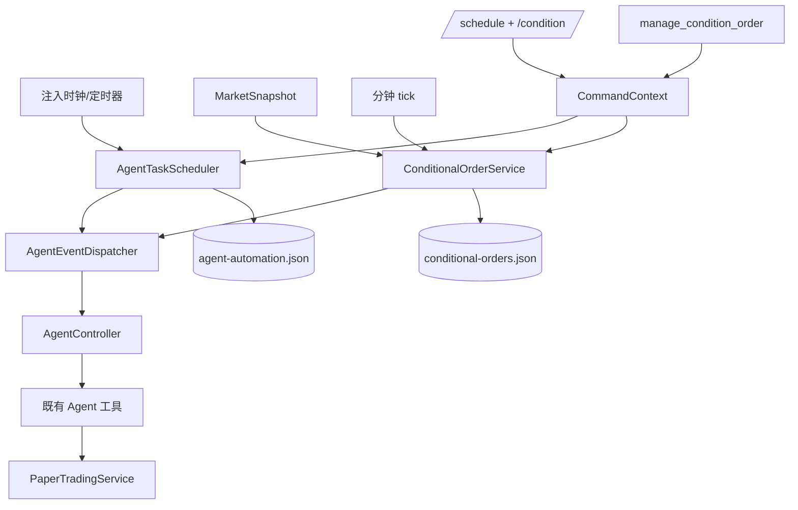

# Design Document

## Overview

定时 Agent 与模拟盘条件单由三条独立链路组成：

1. `AgentTaskScheduler` 按 Asia/Shanghai 时间触发盘前计划和盘中周期检查。
2. `AgentEventDispatcher` 把系统事件串行送入 `AgentController.prompt`，避免自动任务、条件单和用户输入并发写同一个 Agent 会话。
3. `ConditionalOrderService` 在行情快照或时钟事件到达时评估条件单，触发后仅向 Agent 发送带证据的决策请求；是否预览、执行或放弃仍由 Agent 和既有 `PaperTradingService` 完成。

调度器不修改交易服务，条件单也不是挂单成交器。它只产生可审计的 Agent 决策事件，因此资金、整手、费用、持仓、T+1、A 股范围和海外股票仅分析规则继续在 `PaperTradingService` 单点执行。

## Steering Document Alignment

### Technical Standards (tech.md)

`.spec-workflow/steering/` 当前为空，无额外技术 steering。设计遵循项目根约束：

- 使用 Bun；测试通过 `bun test`，完整验证通过 `bun run check`。
- 新行为先写失败测试。
- 每个源文件不超过 250 个非空行。
- 所有可见 TUI 行通过 `src/width.ts` 适配给定宽度。
- A 股界面保持红涨绿跌。

### Project Structure (structure.md)

无项目结构 steering。沿用当前分层：

- `src/app.ts` 只做组合和生命周期。
- `src/commands.ts` 与 `src/*-commands.ts` 提供用户命令。
- `src/agent-tools.ts` 聚合 Agent 工具；新增条件单工具拆到独立文件，避免超过行数上限。
- 纯领域逻辑与持久化分开，测试使用注入时钟、注入定时器和临时目录。

## Code Reuse Analysis

### Existing Components to Leverage

- **`AgentController`**: 继续作为唯一 Agent 会话入口；新增 `busy` 只读状态供调度器安全判断，自动事件仍调用 `prompt(input)`。
- **`AutoRefreshController` / `RefreshScheduler`**: 复用“注入定时器、启动幂等、停止清理、回调失败不杀死调度器”的模式，但不改行情/新闻 15s/60s 刷新职责。
- **`CommandContext`**: 作为命令和 Agent 工具访问调度器、条件单服务的唯一胶水面。
- **`PaperTradingService`**: 继续执行全部模拟账户风控；条件单和调度器不得直接调用 `execute`。
- **`MarketIntelligenceApp.refreshMarket`**: 行情刷新完成后继续 `trading.updatePrices`，并新增条件单快照评估。
- **`MarketSnapshot` / `MarketQuote`**: 作为价格和涨跌幅条件证据；缺少 `asOf` 时使用快照接收时间并在提示中标记“本地接收时间”。
- **`writeJsonFileAtomically` / `defaultAppDataPath`**: 条件单和调度配置继续使用原子 JSON 写入与 `0o600` 文件权限。
- **`parseMarketCode` / `isAshareCode`**: 创建条件单时区分 A 股交易型条件和海外分析型提醒。
- **`tradingDate`**: 所有盘前、盘中、T+1 相关日期判断固定使用 Asia/Shanghai，不在 UI 层另算时区。

### Integration Points

- **启动生命周期**: `main.ts` 的 `tui.addStartListener` 在 `startAutoRefresh()` 旁调用 `app.startAutomation()`；构造函数不启动真实定时器。
- **退出生命周期**: `app.dispose()` 依次停止自动任务、停止行情/新闻刷新、取消待派发事件、abort Agent、等待 Agent idle，再释放 Skill/MCP 扩展。
- **行情流**: `MarketDataSource.loadSnapshot(union(watchlist, activeConditionCodes))` → `MarketWorkspace.applySnapshot` → `PaperTradingService.updatePrices` → `ConditionalOrderService.handleMarketSnapshot`。
- **Agent 事件流**: Scheduler/Condition → `AgentEventDispatcher.enqueue` → `AgentController.prompt` → 既有 Agent 工具 → Agent 面板展示。
- **命令流**: `/schedule`、`/condition` → `CommandContext.agentSchedule()` / `CommandContext.conditionalOrders()` → 中文 `CommandResult`。
- **Agent 工具流**: `manage_condition_order` → `ConditionalOrderService` → 原子持久化与状态结果。

## Architecture



### Modular Design Principles

- **Single File Responsibility**: 调度、市场时段、事件派发、条件单模型、条件单评估、持久化、命令和 Agent 工具分离。
- **Component Isolation**: TUI 只读取 `AutomationStatusView`，不接触定时器或条件单评估。
- **Service Layer Separation**: `ConditionalOrderService` 管状态和触发，纯函数 `evaluateConditionalOrders` 管匹配，store 管文件。
- **Utility Modularity**: Asia/Shanghai 市场时段判断独立成纯函数，调度器和条件单共用。

## Components and Interfaces

### `src/trading-calendar.ts`

- **Purpose:** 统一 A 股日期与交易时段判断。
- **Interfaces:**
  - `shanghaDateTime(now: Date): { date: string; minutes: number; weekday: number }`
  - `isContinuousAuction(now: Date): boolean`：工作日 09:30–11:30、13:00–15:00。
  - `isWeekday(now: Date): boolean`
- **Dependencies:** `tradingDate` 或相同 Asia/Shanghai 格式化规则。
- **Reuses:** `trading-utils.ts` 的时区约定。

### `src/agent-scheduler.ts`

- **Purpose:** 触发盘前计划和盘中周期检查，维护调度状态。
- **Interfaces:**
  - `start(): void`
  - `stop(): void`
  - `runNow(kind: AgentTaskKind): Promise<AgentTaskRunResult>`
  - `status(now?: Date): AgentAutomationStatus`
  - `updateSettings(patch: AgentAutomationSettingsPatch): AgentAutomationStatus`
  - `dispose(): Promise<void>`
- **Dependencies:** 注入时钟、定时器、事件 dispatcher、settings store、市场时段函数。
- **Reuses:** `AutoRefreshController` 的启动幂等、停止清理和静默错误模式。

实现要点：

- 默认配置：启用、盘前 08:45、盘中每 5 分钟；配置持久化到 `agent-automation.json`。
- 使用单一分钟 tick 计算到期任务，而不是为每个任务注册多个 timer；休眠后只补跑最近一次盘前或盘中任务。
- 盘前任务每个 Shanghai 交易日最多一次；盘中任务仅在连续竞价窗口触发。
- 盘中上一事件仍在 dispatcher 队列中时，以固定 `dedupeKey` 跳过并记录。
- `runNow("intraday")` 支持用户在非交易时段手动检查；自动 tick 仍受交易时段限制。

### `src/agent-event-dispatcher.ts`

- **Purpose:** 串行派发系统事件，防止调度、条件单和用户输入并发写 Agent。
- **Interfaces:**
  - `enqueue(event: AgentSystemEvent): AgentEventEnqueueResult`
  - `pendingCount(): number`
  - `cancelPending(reason: string): number`
  - `dispose(): Promise<void>`
- **Dependencies:** `AgentController`、状态监听回调。
- **Reuses:** `AgentController.waitForIdle()`、`AgentController.prompt()`。

实现要点：

- 队列串行执行；派发前同步检查 `agent.busy`，忙则等待 idle 后再检查并调用 `prompt`。
- 同一 `dedupeKey` 已在队列或运行中时返回 `deduped`，不重复唤醒。
- 条件单事件不因为 Agent 忙而丢失；盘前/盘中事件由调度器决定延后或跳过。
- `dispose` 清空未派发队列，abort 当前 Agent，并等待 `waitForIdle()`。

### `src/conditional-orders.ts`

- **Purpose:** 条件单类型、验证和纯评估函数。
- **Interfaces:**
  - `validateConditionalOrderInput(input, context): ConditionalOrderValidation`
  - `evaluateConditionalOrders(orders, quotesByCode, now, marketOpen): ConditionalOrderEvaluation`
  - `isConditionalOrderState(value: unknown): value is ConditionalOrderState`
- **Dependencies:** 市场代码解析、行情 quote、注入时钟。
- **Reuses:** `parseMarketCode`、`isAshareCode`、`MarketQuote`。

评估规则：

1. 先处理 `expiresAt`，过期单进入 `expired`，不再触发。
2. `paused`、`cancelled`、`triggered` 状态不参与评估。
3. 价格与涨跌幅条件要求 `marketOpen === true`、价格有限且大于 0。
4. 价格条件使用 `quote.asOf ?? snapshot.fetchedAt ?? receivedAt` 去重；同一时间戳不重复触发。
5. 涨跌幅条件以创建时保存的 `referencePrice` 为基准。
6. 单次条件触发后状态为 `triggered`；重复条件保持 `enabled`，但冷却期内不触发。
7. 评估函数只返回状态迁移和证据，不写文件、不发 Agent 请求。

### `src/conditional-order-store.ts`

- **Purpose:** 条件单 JSON 持久化。
- **Interfaces:**
  - `load(): ConditionalOrderStoreLoadResult`
  - `save(state: ConditionalOrderState): void`
- **Dependencies:** `writeJsonFileAtomically`、`readJsonFile`、`defaultAppDataPath`。
- **Reuses:** `PaperAccountStore` 的原子写和严格结构校验模式。

与账户 store 的差异：条件单文件损坏不能阻止应用启动。`load()` 返回 `{ state: EMPTY_CONDITIONAL_ORDER_STATE, diagnostic }`，诊断展示在调度/条件单状态中；文件缺失返回空集合且无诊断。

### `src/conditional-order-service.ts`

- **Purpose:** 条件单 CRUD、行情/时钟评估、触发历史与 Agent 唤醒。
- **Interfaces:**
  - `create(input: CreateConditionalOrderInput): Promise<ConditionalOrder>`
  - `list(): readonly ConditionalOrder[]`
  - `cancel(id: string): ConditionalOrder`
  - `pause(id: string): ConditionalOrder`
  - `resume(id: string): ConditionalOrder`
  - `activeCodes(): readonly string[]`
  - `handleMarketSnapshot(snapshot: MarketSnapshot, receivedAt?: Date): Promise<readonly ConditionalOrderTrigger[]>`
  - `handleClock(now?: Date): Promise<readonly ConditionalOrderTrigger[]>`
  - `status(): ConditionalOrdersStatus`
  - `dispose(): void`
- **Dependencies:** store、dispatcher、quote resolver、trading lot size、clock。
- **Reuses:** `PaperTradingService.lotSize`（新增只读 getter）、`context.quote` 的临时代码解析能力。

创建规则：

- 交易型动作：`code` 必须是 A 股，`quantity` 必须是正整数且为 `trading.lotSize` 整数倍。
- 分析型动作：允许海外代码，`quantity` 省略。
- 价格/涨跌幅阈值必须有限且大于 0；涨跌幅创建时解析并保存 `referencePrice`。
- 时间条件必须是可解析 ISO 时间且晚于当前时间。
- `expiresAt` 默认当天 15:00（Asia/Shanghai），可显式指定；过期输入拒绝。

触发规则：

- 服务先持久化触发状态和历史，再向 dispatcher enqueue Agent 决策事件；即使应用随后退出，也能看到已触发证据。
- prompt 包含条件单 ID、代码、动作、条件、触发价/时间、基准价、数据时间、当前持仓约束和“可执行、预览或放弃”的明确选项。
- 服务永远不调用 `PaperTradingService.execute`。

### `src/agent-automation-store.ts`

- **Purpose:** 调度配置持久化。
- **Interfaces:**
  - `load(): AgentAutomationSettingsLoadResult`
  - `save(settings: AgentAutomationSettings): void`
- **Dependencies:** JSON 文件工具。
- **Reuses:** 原子写与严格校验。

### 命令：`src/automation-commands.ts`

- **Purpose:** 给用户查看和控制调度与条件单。
- **Commands:**
  - `/schedule`：显示启用状态、下一次任务、上次结果、条件单统计。
  - `/schedule on|off`
  - `/schedule preopen <HH:mm>`
  - `/schedule interval <minutes>`
  - `/schedule run preopen|intraday`
  - `/condition list`
  - `/condition price <code> <buy|sell> <quantity> <above|below> <price> [until ISO]`
  - `/condition change <code> <buy|sell> <quantity> <up|down> <percent> [until ISO]`
  - `/condition time <code> <analyze|buy|sell> [quantity] <ISO>`
  - `/condition cancel|pause|resume <id>`
- **Dependencies:** `CommandContext.agentSchedule()`、`CommandContext.conditionalOrders()`。
- **Reuses:** 现有 `output` / `error` 命令结果模式和中文分类。

### Agent 工具：`src/condition-agent-tools.ts`

- **Purpose:** 让 Agent 显式管理条件单，不用自然语言伪造操作。
- **Tool:** `manage_condition_order`
  - `action: "list" | "create" | "cancel" | "pause" | "resume"`
  - create 参数包含 code、condition、action、expiresAt、triggerPolicy、cooldownMinutes、note。
- **Dependencies:** `CommandContext.conditionalOrders()`。
- **Reuses:** `jsonResult`、zod schema、既有工具结果约定；`createAStockAgentTools` 仅追加该工具数组。

### TUI 状态

- 新增 `AutomationStatusView`：启用状态、下一次任务、上次任务结果、启用条件单数、触发数、存储诊断。
- `renderAppFrame` 把该视图传给 `AgentWorkspace`；Agent 面板上下文行显示紧凑状态，例如 `自动化 09:30 · 条件单 3`。
- 状态文本使用 `fitLine` 适配宽度，不新增工作区、不挤压行情/持仓/新闻布局。

## Data Models

### `AgentAutomationSettings`

```ts
interface AgentAutomationSettings {
  readonly version: 1
  enabled: boolean
  preopenTime: string // HH:mm，Asia/Shanghai
  intradayIntervalMinutes: number // 1..60，默认 5
  conditionCooldownMinutes: number // 重复条件默认冷却，默认 15
}
```

### `AgentSystemEvent`

```ts
type AgentSystemEventKind = "preopen" | "intraday" | "condition"

interface AgentSystemEvent {
  readonly kind: AgentSystemEventKind
  readonly dedupeKey: string
  readonly title: string
  readonly prompt: string
  readonly createdAt: string
}
```

### `ConditionalOrder`

```ts
type ConditionalOrderCondition =
  | { readonly type: "price"; readonly operator: "gte" | "lte"; readonly price: number }
  | {
      readonly type: "change-percent"
      readonly operator: "gte" | "lte"
      readonly percent: number
      readonly referencePrice: number
    }
  | { readonly type: "time"; readonly at: string }

type ConditionalOrderAction =
  | { readonly kind: "trade"; readonly side: "buy" | "sell"; readonly quantity: number }
  | { readonly kind: "analyze" }

interface ConditionalOrder {
  readonly id: string
  readonly code: string
  readonly name: string
  readonly condition: ConditionalOrderCondition
  readonly action: ConditionalOrderAction
  readonly triggerPolicy: "once" | "repeat"
  readonly cooldownMinutes: number
  readonly note: string
  readonly createdAt: string
  readonly expiresAt: string
  status: "enabled" | "paused" | "triggered" | "cancelled" | "expired"
  lastEvaluatedAt?: string
  lastEvidenceAt?: string
  lastTriggeredAt?: string
  readonly history: readonly ConditionalOrderEvent[] // 最多保留最近 20 条
}
```

### `ConditionalOrderState`

```ts
interface ConditionalOrderState {
  readonly version: 1
  sequence: number
  orders: ConditionalOrder[]
}
```

### `AutomationStatusView`

```ts
interface AutomationStatusView {
  readonly enabled: boolean
  readonly nextRunLabel: string | null
  readonly lastRunLabel: string | null
  readonly activeConditions: number
  readonly triggeredConditions: number
  readonly diagnostic: string | null
}
```

## Error Handling

### Error Scenarios

1. **Agent 未配置或模型失败**
   - **Handling:** `AgentController` 保持现有 `unconfigured/error` 状态；dispatcher 记录结果但不中断队列后续事件。
   - **User Impact:** Agent 面板显示配置或模型错误；调度状态显示最近失败原因。

2. **盘前/盘中任务与 Agent 用户请求重叠**
   - **Handling:** dispatcher 串行等待；盘中固定 dedupe key 已存在时跳过，盘前事件延后到 Agent idle。
   - **User Impact:** `/schedule` 显示“已跳过：上一任务运行中”或“等待 Agent 空闲”。

3. **行情缺失、过期或市场未开盘**
   - **Handling:** 价格和涨跌幅条件不触发；任务 prompt 要求 Agent 明确数据限制。
   - **User Impact:** Agent 回答和 `/condition list` 显示最近评估原因，不伪造实时行情。

4. **条件单文件损坏**
   - **Handling:** store 返回空集合和诊断，不 throw；不覆盖原文件，等待用户修复或删除后首次保存。
   - **User Impact:** `/schedule` 与 `/condition list` 显示“条件单文件损坏”，应用继续运行。

5. **触发后 Agent 放弃或交易风控失败**
   - **Handling:** 条件单保留 `triggered` 与历史；重复单按冷却时间后可再次触发；不自动重试成交。
   - **User Impact:** Agent 面板显示放弃原因或 `preview_trade/execute_trade` 的账户错误。

6. **退出时任务运行中**
   - **Handling:** 停止定时器、清空未派发事件、abort Agent、等待 idle、释放扩展。
   - **User Impact:** 无未处理 Promise、无后台计时器或退出后写盘。

## Testing Strategy

### Unit Testing

- `trading-calendar`: 工作日、周末、09:29/09:30、11:30/13:00、15:00 边界。
- `agent-scheduler`: 默认配置、盘前每日一次、盘中 5 分钟、非交易时段不触发、手动触发、重叠跳过、休眠补跑一次、stop/dispose 清理。
- `agent-event-dispatcher`: 串行顺序、dedupe、Agent busy 等待、取消队列、错误不阻断后续事件。
- `conditional-orders`: 三类条件、参考价、过期、暂停/取消、重复冷却、无效代码/数量/阈值、海外分析与交易边界。
- `conditional-order-store`: 缺失文件、正常恢复、版本不兼容、损坏 JSON、原子保存。

### Integration Testing

- App 启动时装载调度配置和条件单；`startAutomation()` 只在 TUI start 后注册 timer。
- 行情刷新请求合并自选股和启用条件单代码；刷新完成后触发条件评估。
- 条件触发后 scripted Agent 收到含 ID 和证据的 prompt；Agent 可调用既有 `preview_trade/execute_trade`。
- `/schedule`、`/condition` 命令改变状态并在中文结果中展示。
- `manage_condition_order` 工具创建/暂停/恢复/取消并触发 `portfolioChanged` 之外的正确 UI 更新。
- `dispose()` 清理 fake timers、取消 dispatcher、abort Agent、释放扩展。

### End-to-End Testing

- 使用 fake clock、fake scheduler、scripted Agent 和临时数据目录：
  1. 08:45 自动生成盘前计划，包含韩美日与新闻工具调用。
  2. 盘中每 5 分钟触发检查；Agent 忙时跳过重叠 tick。
  3. 创建价格条件单，行情快照越阈值后唤醒 Agent，Agent 自主执行本地模拟交易。
  4. Agent 放弃操作时条件单有触发历史，账户状态不变。
  5. 重启应用恢复条件单和调度配置；过期单不会触发。
- 最终运行 `bun run check`，确认类型、lint 和全部测试通过。
